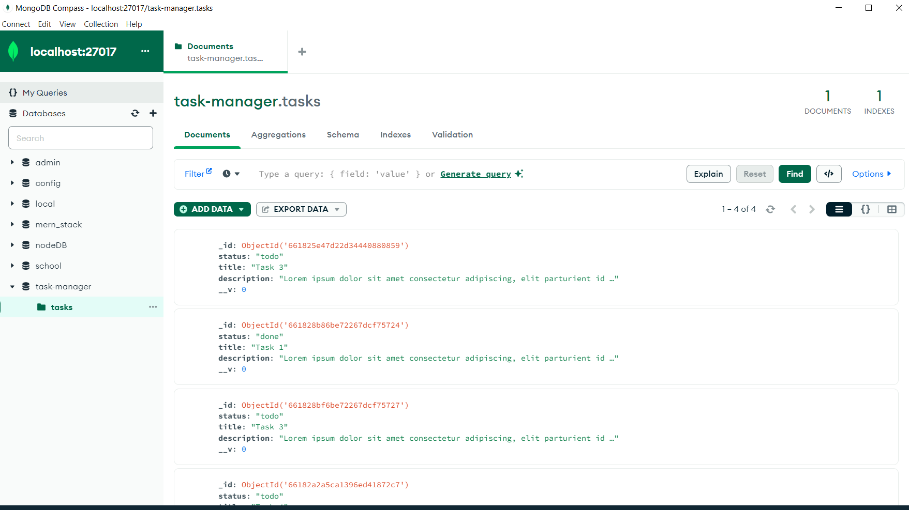
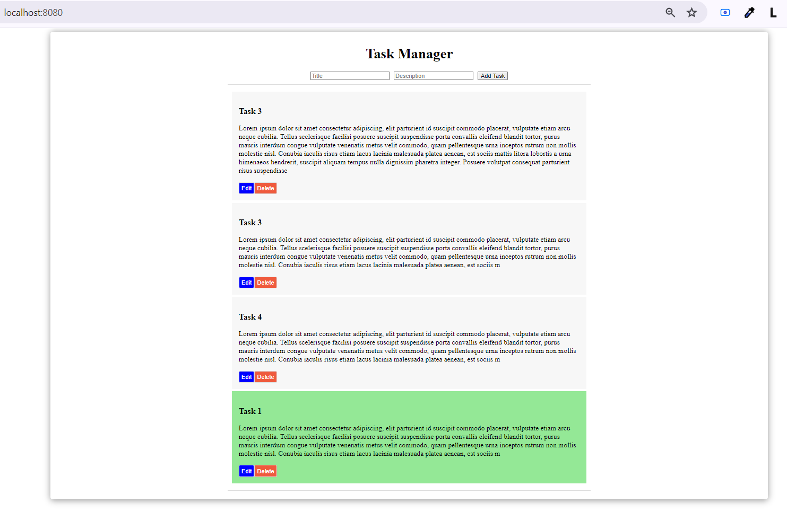
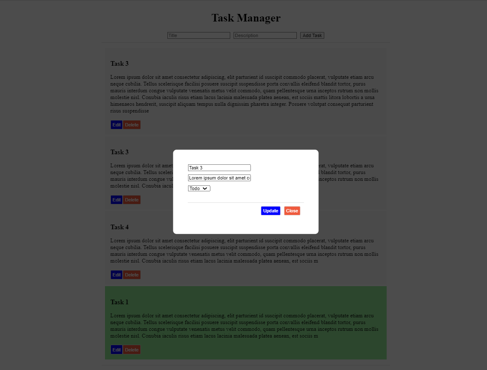

# Changes - MERN Task Manager Codebase Assessment

* Created server & client folder structure

## Server 

* Seperated router and model
* Made required changes in mongoose.connect
* npm install --save cors 

## Client
npm i dotenv

## Page

## Edit
